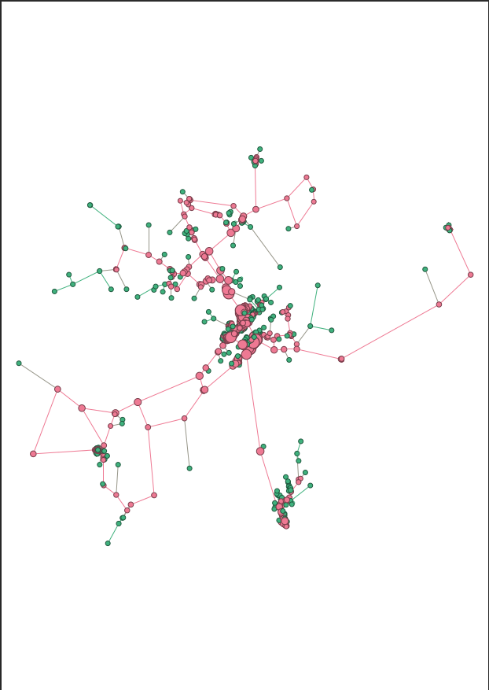
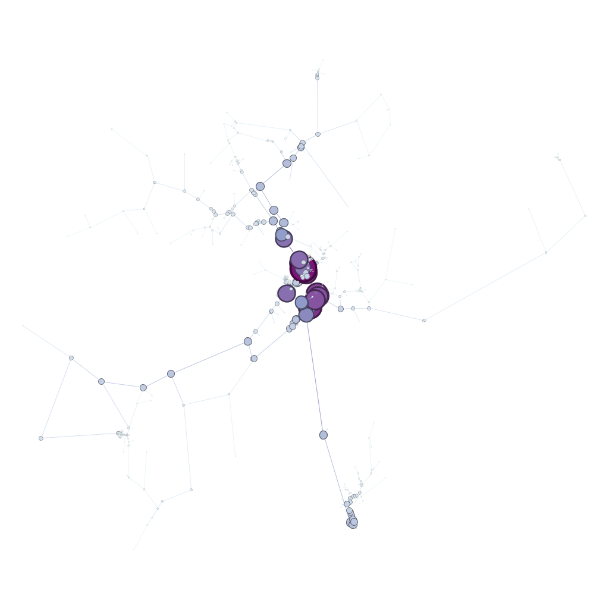
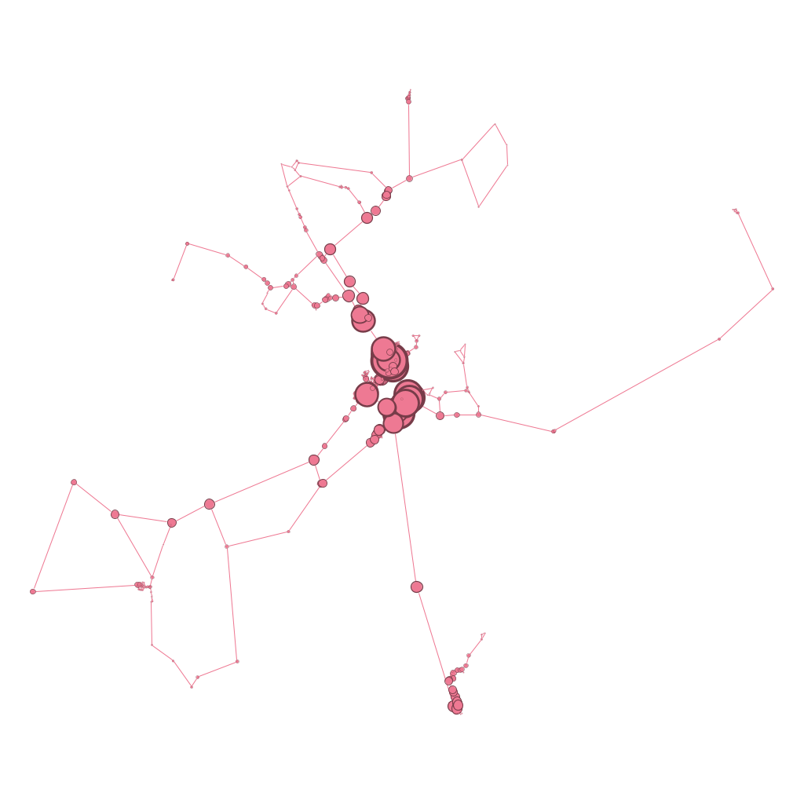
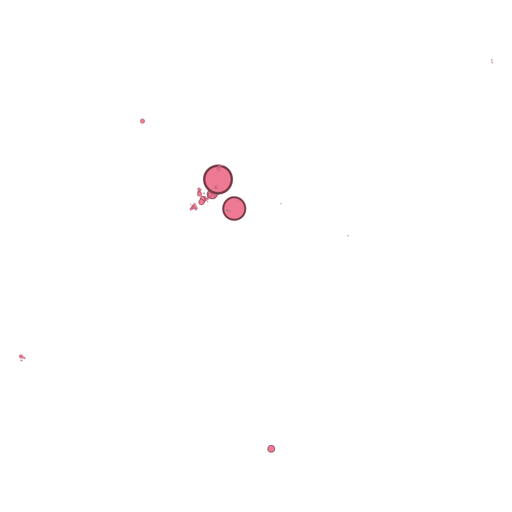
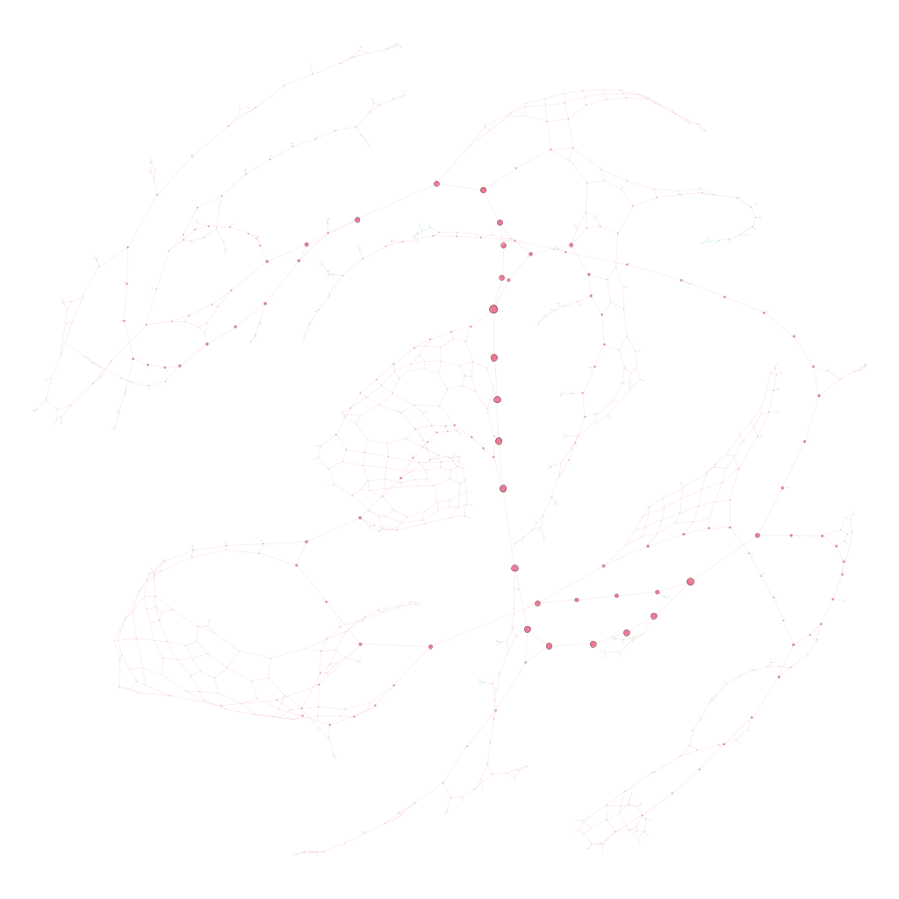

# Análise Estrutural da Malha Viária de Jucurutu, RN

## Grupo 12

- João Pedro Araújo Ramalho
- Kiev Luiz Freitas Guedes
- Maria Eduarda Silva da Costa

## Identificação da Região
**Região Analisada:** Jucurutu, Rio Grande do Norte, Brasil.
Jucurutu é um município no interior do Rio Grande do Norte, caracterizado por ser cortado pelo Rio Piranhas-Açu, o que cria gargalos naturais de mobilidade (como pontes e vias de acesso principais).

## Vídeo de Apresentação
[Link do Vídeo no Loom](https://www.loom.com/share/4a89010c9bd6480b943850870898058a)

## Objetivo do Trabalho
O objetivo deste trabalho é aplicar conceitos de teoria dos grafos em uma rede real, interpretando a malha viária da cidade de Jucurutu como um grafo. A proposta busca identificar nós centrais (hubs), regiões estruturalmente densas (k-core) e pontos críticos de conexão (betweenness), indo além da execução de código para obter uma interpretação crítica urbana.

## Metodologia
1. **Extração de Dados:** A rede viária foi extraída do OpenStreetMap utilizando a biblioteca Python **OSMnx**, configurada para capturar ruas que permitem o tráfego de veículos (`network_type="drive"`).
2. **Construção do Grafo:** O grafo resultante possui cruzamentos como nós e trechos de ruas como arestas. Para garantir a corretude algorítmica, o grafo foi convertido para uma versão simples e não direcionada.
3. **Cálculo de Métricas:** Através do **NetworkX**, calculamos métricas de centralidade, grau e decomposição estrutural.
4. **Exportação e Visualização:** O grafo com seus atributos foi exportado no formato `.graphml` para ser importado e visualizado de forma geográfica e estrutural com o **Gephi**.

## Métricas Calculadas
Foram extraídos 963 nós e 1.278 arestas (no grafo simples não-direcionado). As métricas analisadas incluem:
* **Grau e Distribuição de Grau:** Quantidade de ruas conectadas a cada cruzamento.
* **Betweenness Centrality (Centralidade de Intermediação):** Identificação de gargalos na rede viária.
* **Closeness Centrality (Centralidade de Proximidade):** O quão rápido é possível alcançar qualquer outro nó a partir de um cruzamento.
* **K-Core Decomposition:** Identificação das áreas mais densas da rede, com foco no núcleo principal (k=2).

## Principais Visualizações
* *Distribuição de Grau:* Gráfico de barras indicando que a grande maioria dos nós possui grau 1 (ruas sem saída) ou 3 (cruzamentos em T).
* *Gargalos da Rede:* Visualização geográfica destacando os nós com maior Betweenness, indicando as vias de acesso essenciais.
* *Decomposição K-Core:* Visualização da remoção das franjas da rede, mantendo apenas o núcleo viário.

## Respostas às Questões Obrigatórias

**1. Os nós com maior grau coincidem com os nós de maior betweenness?**
Não. Os nós com maior grau (hubs de grau 4 ou 5) são cruzamentos com muitas conexões locais, mas não necessariamente as vias mais vitais para cruzar a cidade. Já os nós com maior betweenness costumam ter graus menores (como 2 ou 3), mas atuam como pontes vitais entre regiões inteiras da cidade.

**2. O núcleo identificado pelo k-core coincide com os principais hubs?**
O *main core* (neste caso, k=2) engloba 676 dos 963 nós da rede. Os principais hubs estão contidos dentro desse núcleo, mas o k-core abrange uma área muito mais vasta que apenas os hubs, servindo essencialmente para filtrar as "franjas" da rede (ruas sem saída com k=1, que são 287 nós).

**3. O que a métrica de betweenness revela que o grau não revela?**
O grau revela apenas a conectividade **local** (quantas vias chegam àquele cruzamento específico). O betweenness revela a importância **global** do nó. Um nó de betweenness alto é um corredor de fluxo crítico; se ele for bloqueado, o tráfego da cidade inteira pode ser forçado a fazer longos desvios.

**4. O que muda quando a rede é analisada em sua posição geográfica real e quando é analisada por um layout estrutural?**
A análise geográfica mantém a fidelidade física: distâncias, rios e formatos de quadras limitam a visualização. O layout estrutural (como o ForceAtlas2 no Gephi) ignora o espaço físico e agrupa os nós puramente pela densidade de conexões. Vias que formam comunidades fortes se aproximam no centro visual, enquanto ruas isoladas são empurradas para a periferia da imagem, revelando o "esqueleto topológico" da malha.

**5. Existem regiões críticas para mobilidade urbana na área analisada?**
Sim. Os dados mostram nós com uma centralidade de intermediação (betweenness) excepcionalmente alta (entre 0.35 e 0.46), o que significa que até 46% dos caminhos mais curtos da cidade passam por um único ponto. Isso indica fortíssimos gargalos, muito provavelmente relacionados às pontes sobre o Rio Piranhas e à Rodovia BR-226 que corta a região.

**6. A rede parece homogênea ou apresenta concentração estrutural?**
A rede apresenta forte concentração estrutural e dependência de poucos caminhos. O fato do betweenness máximo chegar a ~0.46 revela que a rede está longe de ser homogênea em relação ao fluxo. Além disso, a presença de quase 30% da rede como nós de k=1 aponta muitas ramificações periféricas ou ruas sem saída ao redor do núcleo conectado.

**7. Os resultados obtidos fazem sentido considerando o conhecimento urbano da região escolhida?**
Sim, fazem todo o sentido. Cidades do interior cortadas por acidentes geográficos severos (como o Rio Piranhas em Jucurutu) tendem a apresentar poucos pontos de travessia. Esses cruzamentos ou rodovias de ligação absorvem quase todo o tráfego em viagens longas, o que se reflete matematicamente nos altos valores de Betweenness identificados pela análise.

## Principais Conclusões
O uso de métricas de grafos permitiu identificar matematicamente o que a intuição sobre a cidade sugere: Jucurutu possui uma malha viária fortemente dependente de um pequeno conjunto de vias de ligação. O planejamento urbano deve observar com atenção esses cruzamentos de alta centralidade de intermediação, pois acidentes ou interdições nestes nós causam um impacto muito maior à mobilidade do município do que em qualquer outro local da malha.

## Análise Visual da Rede Urbana no Gephi

### Visualização Geográfica (Geo Layout Base)

Nesta configuração, a rede foi posicionada fielmente às suas coordenadas reais de latitude e longitude. Para facilitar a leitura estrutural, aplicamos um "combo" de atributos visuais: a cor diferencia o core number (rosa para o núcleo contínuo, verde para a periferia) e o tamanho dos nós é proporcional ao seu grau (evidenciando os cruzamentos de maior fluxo). Inicialmente, a intenção era destacar também a métrica de betweenness centrality através de rótulos de texto (labels). Contudo, devido a limitações na renderização de exportação do Gephi — onde os textos ficavam ilegíveis ou não eram renderizados corretamente, optamos por solucionar o problema criando um mapa de calor dedicado exclusivamente a essa métrica na visualização posterior.

### Mapa de Gargalos (Betweenness Centrality)

Uma visualização geográfica dedicada exclusivamente a revelar a centralidade de intermediação. Utilizando um gradiente de cor e tamanho em tons de roxo, este mapa destaca os verdadeiros "gargalos" viários do município. Ficam evidentes os pontos críticos de articulação e passagem obrigatória, onde uma interdição causaria o maior impacto na fluidez geral.

### Subgrafo de Alta Conectividade (K-Core Maior)

Aplicamos um filtro para exibir apenas o subgrafo correspondente ao k-core 2. Escolhemos isolar esse k por ele representar a espinha dorsal da cidade. Ao ocultar a periferia, visualizamos apenas o núcleo estrutural contínuo, formado por vias que oferecem rotas alternativas e garantem fluxo constante sem "becos sem saída".

## Top Hubs Topológicos (Top 10% dos nós por grau)

Aplicamos um filtro de grau para exibir exclusivamente os maiores cruzamentos da cidade (nós de graus 4 e 5). Estatisticamente, essa seleção reteve 155 nós, o que representa 16,1% da malha viária (de um total de 963 nós). Devido à natureza discreta e exata do grafo, não é possível aplicar um corte arbitrário de exatos "10%": exibir apenas o grau 5 representaria menos de 1% da rede, enquanto a inclusão necessária do grau 4 ajusta a amostra para os 16,1% reais.

### Esqueleto Estrutural (ForceAtlas 2)

O algoritmo atua como uma atração magnética: nós fortemente conectados (grandes hubs e o núcleo) são puxados para o centro, enquanto conexões fracas são repelidas para as bordas. Isso escancara a densidade da rede e os centros de gravidade do tráfego, independentemente da distância física entre as vias.

